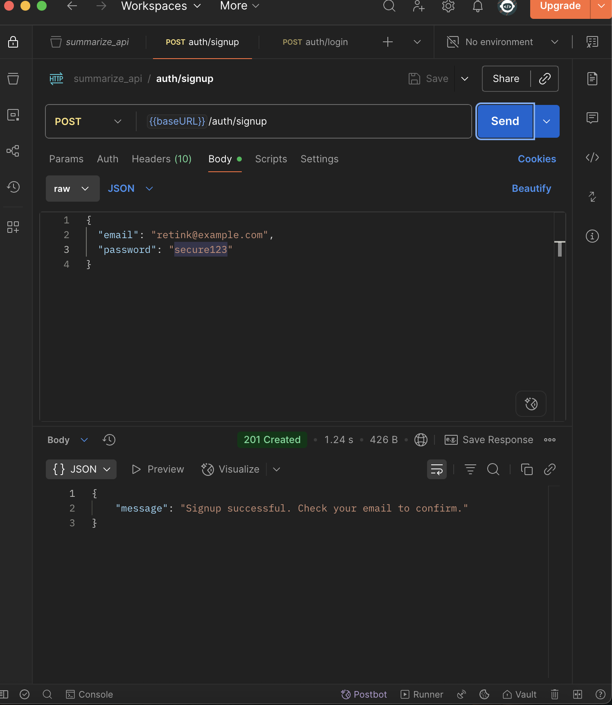
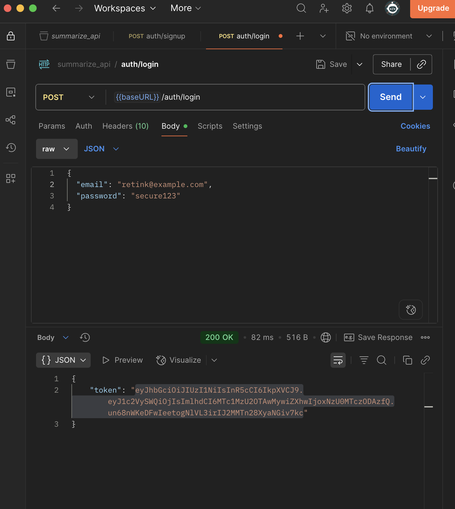
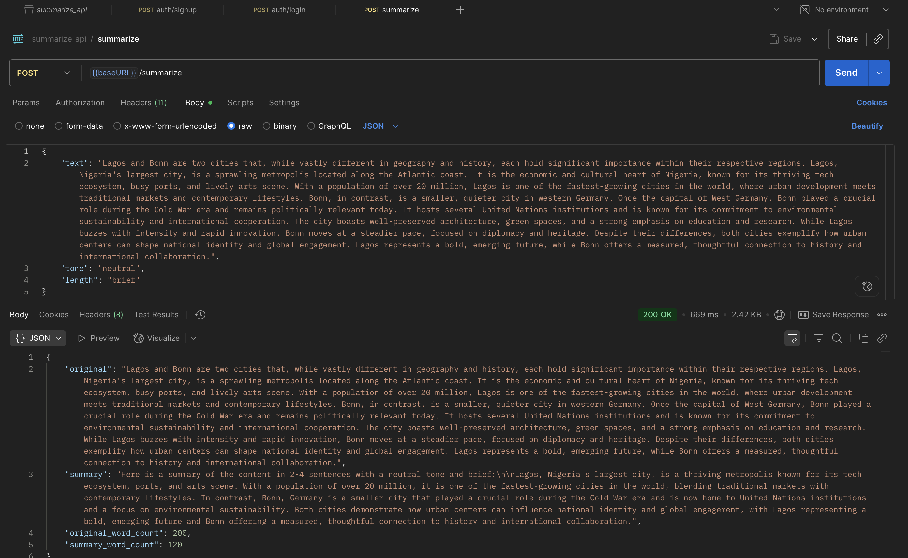

# Summarize API

## Overview

The Summarize API is a backend service designed to provide text summarization capabilities using a Large Language Model (LLM). It is built with Node.js and Express, offering secure authentication, rate limiting, and robust error handling.

## Live Production

https://eirly-ai-be8b5bcf5e1b.herokuapp.com/

## Website Instructions

1. **Signup**: 
   - Visit the live production URL.
   - Sign up using your email address.
   - Check your email inbox for a confirmation email and confirm your email address.

2. **Login**:
   - After confirming your email, log in using your credentials.

3. **Using the Summarizer**:
   - Enter a text that is over 200 characters in length.
   - Input the desired tone for the summary, such as "informative".
   - Choose the length of the summary, e.g., "short", "very short", or "brief".
   - Click the "Summarize" button.

4. **Results**:
   - You will see the original text displayed.
   - The summarized text will be shown below the original.
   - The word count for both the original and summarized text will be displayed.

5. **Summary History**:
   - Users can view their summary history on the history page.

6. **Summary Quota**:
   - Each user has a daily quota of 20 summaries.
   - The quota resets every 24 hours.

## Architecture

The application follows a modular architecture with the following key components:

- **Controllers**: Handle incoming requests and return responses.
- **Middleware**: Process requests at various stages of the request-response cycle.
- **Models**: Define the data structure and interact with the database.
- **Routes**: Define the endpoints and link them to controller functions.
- **Services**: Contain business logic and interact with external APIs or services.
- **Utilities**: Provide helper functions for logging and other tasks.

## Project Structure

- **controllers/**: 
  - `authController.js`: Manages user login, registration, and token generation.
  - `summarizeController.js`: Processes text summarization requests and interacts with the LLM service.

- **middleware/**:
  - `authMiddleware.js`: Verifies JWT tokens and protects routes.
  - `checkQuota.js`: Ensures users do not exceed their allowed usage quota.
  - `errorHandler.js`: Catches and processes errors, sending appropriate responses.

- **models/**:
  - `sequelize.js`: Configures Sequelize ORM for database interactions.
  - `user.js`: Defines the User model with fields for authentication.
  - `summary.js`: Defines the Summary model for storing summarized text.

- **routes/**:
  - `auth.js`: Endpoints for user authentication (e.g., login, register).
  - `summarize.js`: Endpoints for text summarization requests.

- **services/**:
  - `emailService.js`: Sends emails for notifications or confirmations.
  - `llmService.js`: Interfaces with the LLM API to perform text summarization.

- **utils/**:
  - `logger.js`: Configures and manages application logging using Winston.

## Installation

1. **Clone the repository**:
   ```bash
   git clone <repository-url>
   cd summarize-api
   ```

2. **Install dependencies**:
   ```bash
   npm install
   ```

3. **Environment Variables**: Create a `.env` file in the root directory with the following variables:
   - `PORT`: Port number for the server.
   - `FRONTEND_URL`: URL of the frontend application for CORS.
   - `JWT_SECRET`: Secret key for signing JWT tokens.
   - `DATABASE_URL`: Connection string for the database.
   - `LLM_API_KEY`: API key for accessing the LLM service.
   - `FRONTEND_URL`: http://localhost:example
   - `DB_NAME`: exampleName
   - `DB_USER`: exampleUser
   - `DB_PASS`: examplePass
   - `DB_HOST`: exampleHOST
   - `DB_PORT`: 3306

   - `JWT_SECRET`: exampleJWTKey
   - `GROQ_API_KEY`: exampleAPIKEY
   - `SMTP_HOST`:smtp.example.org
   - `SMTP_PORT`: examplePort
   - `SMTP_USER`: exampleUser
   - `SMTP_PASS`: examplePass
   - `FROM_EMAIL`: example@gmail.com

## Running the Application

- **Development**: 
  ```bash
  npm run dev
  ```

- **Production**: 
  ```bash
  npm start
  ```

The application will be accessible at `http://localhost:{port}`.

## Deployment

The application is deployed on Heroku and uses JawsDB for the database. Ensure that your Heroku environment variables are set correctly:

- `JAWSDB_URL`: The connection string provided by JawsDB.

The application can be deployed using a Procfile, which specifies the command to run the application:
```
web: node index.js
```

To deploy to Heroku, follow these steps:

1. **Login to Heroku**:
   ```bash
   heroku login
   ```

2. **Create a Heroku app**:
   ```bash
   heroku create
   ```

3. **Add JawsDB to your Heroku app**:
   ```bash
   heroku addons:create jawsdb-maria:kitefin
   ```

4. **Deploy your code**:
   ```bash
   git push heroku main
   ```

5. **Open your app**:
   ```bash
   heroku open
   ```

Ensure that your `.env` file is configured correctly for local development, but remember that Heroku uses environment variables set in the Heroku dashboard for production.

## Dependencies

- **Express**: Fast, unopinionated, minimalist web framework for Node.js.
- **Sequelize**: Promise-based Node.js ORM for MySQL.
- **JWT**: For secure authentication and authorization.
- **Helmet**: Helps secure Express apps by setting various HTTP headers.
- **CORS**: Middleware for enabling CORS with various options.
- **Rate Limiting**: To limit repeated requests to public APIs.

## Postman Test Results

### Signup Test


### Login Test


### Summarize Test


## License

This project is licensed under the ISC License. 